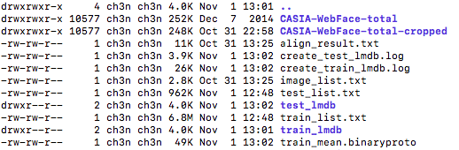

##DataPrepare

Scripts to prepare face data for CNN training.

###Steps:

- 1) build ../FaceAlignment;
- 2) put Webface dataset at ./webface/;
- 3) run face_align.sh to generate align_result.txt(will take several hours);
- 4) run face_wash.py to remove face profile with align_result.txt, and the results lay in washed_align_result.txt;
- 5) run face_crop.py to generate cropped dataset;
- 6) run dataset_div.py to split as Train/Test set;
- 7) specific your caffe_dir in gen_lmdb_imgmean.sh and run it to create LMDBs;
- 8) go to train at ../FaceIdentification;

(all generated data will stay in 'webface' dir)

After above steps, you should get webface dir like this:

###Many Patch:

face_align.sh  >> face_wash.py >> face_align_save.py >> face_align.sh >> face_crop.py >> dataset_div.py

###Result:

 ==>
(64x64)

 <== profile view will be  washed away

###Liscense
MIT