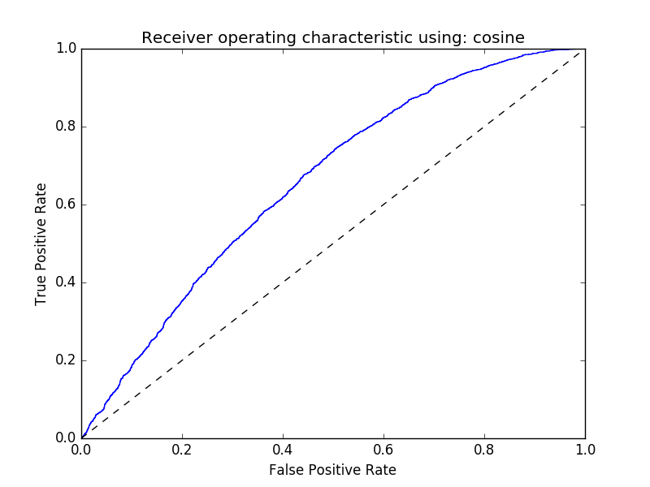

# FriggaVision
Our face identification develop toolkit.

##Intro
###FaceDetection 
Which is from [SeetaFace](https://github.com/seetaface/SeetaFaceEngine) mainly. We add feature of angle selection, which can help us wash the train data, e.g., rejecting all face > 45 degree. But the model provided by SeetaFace has different structure from which they have descriped in the FuSt paper. So the angle selection can not work, because there are only 3 LAB cascaded unit there. What a pity. We need to build an cascaded Face Detection tool  with more accurate performance in profile view situation later.

###FaceAlignment

Which is from SeetaFace too. We fix some build errors under macOS and ubuntu 1604. And add some webface sample image for testing. The model is working, but bad in difficult situation. When time is on our side, we will find an accurate Alignment tool even with bad speed performance(e.g, CNN based), because we use it at data preprocessing not in real-time applicaton.

###DataPrepare
Here contains some tools  to preprocess image data for training of DeepID using above staff. The main target is [Webface dataset](http://www.cbsr.ia.ac.cn/english/CASIA-WebFace-Database.html). The dataset has 5% super profile view image, which is bad for training an network to fetch feature out of mainly frontal faces. For that, we take a wash step there.

###FaceIdentification
Finlly the simple caffe [DeepId(1st gen)](http://mmlab.ie.cuhk.edu.hk/pdf/YiSun_CVPR14.pdf) code. The network is somehow outdated(still use LRN), but it should works. Fresh meat is welcome!

##Build Guide
Follow DataPrepare/readme.md

##Results
###test1
Network and solver is at FaceIdentification/test1/.Only one pitch and one network is used, the pitch is generally cover the total face. 

We use 10000people, and SGD optimization with 500k interation, the training validation accuracy is at 65.5%, which is the same as the paper told.

Use lfwcrop_color, cosine distance. The result ROC is below, it's bad but working.

###test2
Use lfw, not cropped, crop by ourself, with DataPrepare's method. And Joint Bayesian.
TODO

###test3
N pitch + Joint Bayesian
TODO

##LISCENSE

MIT
